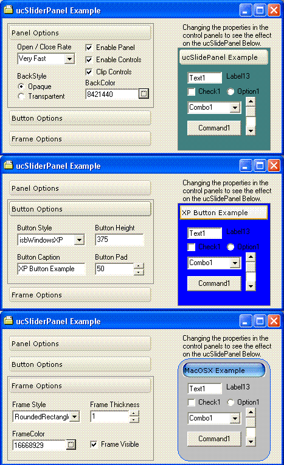

## Sliding Panel Container

### Description

Do your forms need more real estate without the use of Tabs or Frames? Then check out this Sliding Panel Container Control. This control offers a fresh look and feel with the ability to &#8220;host / contain&#8221; subsequent controls. Many of the features of this combination control are customizable (i.e. Backcolor, Frame Shape, Color &amp; Thickness, Rollup Speed, Button Type &amp; Offset, Hosted Controls Dis/Enable, Entire Control Dis/Enable, Transparent/Opaque Backstyle, Frame Thickness, Plus 10 Events!). Suggestions and comments are welcome, as this is the first cut. Updated the VB catagory list (07Jul05).
 
### More Info
 

             |
---                |---
**Submitted On**   |2005-06-27 19:45:46
**By**             |[TerriTop](https://github.com/Planet-Source-Code/PSCIndex/blob/master/ByAuthor/territop.md)
**Level**          |Beginner
**User Rating**    |4.9 (44 globes from 9 users)
**Compatibility**  |VB 4\.0 \(32\-bit\), VB 5\.0, VB 6\.0
**Category**       |[Custom Controls/ Forms/  Menus](https://github.com/Planet-Source-Code/PSCIndex/blob/master/ByCategory/custom-controls-forms-menus__1-4.md)
**World**          |[Visual Basic](https://github.com/Planet-Source-Code/PSCIndex/blob/master/ByWorld/visual-basic.md)
**Archive File**   |[Sliding\_Pa191050772005\.zip](https://github.com/Planet-Source-Code/territop-sliding-panel-container__1-61366/archive/master.zip)

